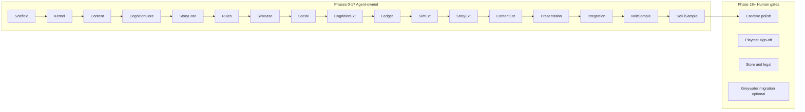
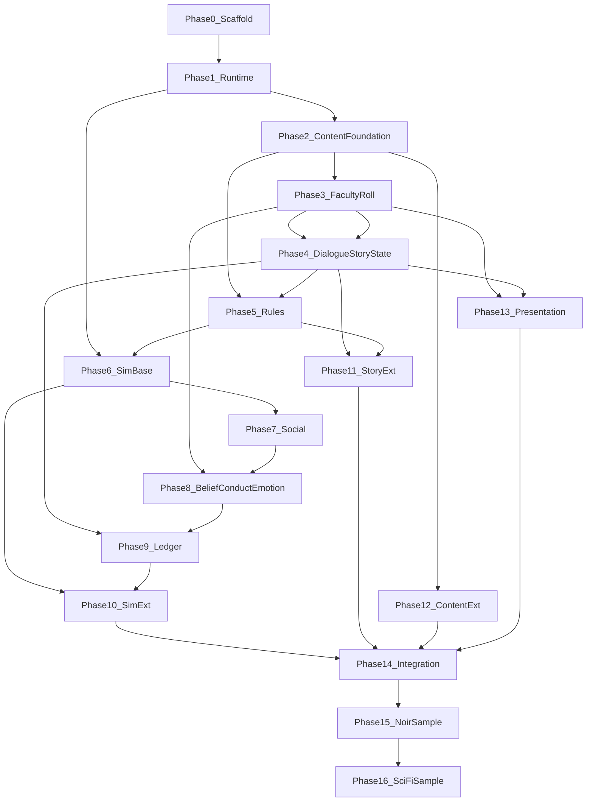

# NSF Development Roadmap (Zero → Production)

**Living execution tracker** for implementing the Narrative Simulation Framework.

- Specs: [System Catalog](index.md) · [Terminology Glossary](terminology-glossary.md) · [Development Roadmap](development-roadmap.md)
- Greywater game plan (separate): legacy reference only — no `Docs/PLAN.md` in this repo.

## Phase status

| Phase | Name | Status | Tests | Notes |
|---|---|---|---|---|
| −1 | Spec API alignment | **done** | — | Phase A doc foundation complete — glossary, runtime-kernel, all 37 system specs aligned |
| 0 | Package scaffold | pending | — | |
| 1 | Runtime kernel | pending | — | |
| 2 | Content foundation | pending | — | |
| 3 | Faculty & Roll | pending | — | |
| 4 | Dialogue & Story State | pending | — | |
| 5 | Rules | pending | — | |
| 6 | Sim base | pending | — | |
| 7 | Social | pending | — | |
| 8 | Belief, Conduct, Emotion | pending | — | |
| 9 | Ledger | pending | — | |
| 10 | Sim extended | pending | — | |
| 11 | Story extended | pending | — | |
| 12 | Content extended | pending | — | |
| 13 | Presentation | pending | — | |
| 14 | Integration | pending | — | |
| 15 | NoirSample | pending | — | |
| 16 | SciFiSample | pending | — | |
| 17 | Production hardening | pending | — | |
| 18 | Human gates | pending | — | |

---

## Context and assumptions

| Input | Decision |
|---|---|
| Starting point | **Greenfield** — new **`NarrativeFramework/` Unity project** (separate repo recommended; Greywater in this repo is legacy and will be dropped). NSF API names from [terminology-glossary.md](terminology-glossary.md). |
| Host project | **Dedicated NSF Unity 6000.4.10f1 project** with `Packages/NarrativeFramework/` as the only game code. Not co-installed with Greywater long-term. |
| Finish line | **Framework + two games** — extractable UPM package, full docs, automated test suite, and two distinct sample content packs proving reusability. |
| Spec source | 37 specs in [`systems/`](systems/), coordinated by [runtime-kernel.md](runtime-kernel.md) simulation loop. |
| Agent workflow | Each phase ends with **automated verification only** (compile + Edit Mode tests + batch setup script). No human playtesting until Phase 18. |
| Side projects | Early: in-package **headless harness** (Edit Mode). Mid: **NoirSample** and **SciFiSample** as Unity package samples (`Samples~/`) in the NSF project. |

---

## Execution readiness (prep audit)

**Verdict: Ready to start Phase 0** after Phase A doc foundation is complete and dedicated NSF Unity project exists.

### Doc foundation gate (Phase A — before Phase 0 code)

- [x] Glossary contracts catalog complete
- [x] All 37 systems specs have aligned `Minimal Engine Interfaces`
- [x] runtime-kernel tick phase map present
- [x] No broken Theory cross-links

### Completed prep (Phase −1 + Phase A doc foundation)

- [x] Glossary **Contracts catalog**, `INarrativeServiceRegistry`, `SimulationTickPhase`, registry naming (`IContentStore` / `ContentRegistry`)
- [x] [runtime-kernel.md](runtime-kernel.md) **Implementation tick phases** + `Minimal Engine Interfaces`
- [x] Spec **Minimal Engine Interfaces** blocks: Service contract + Domain model subsections (all 37 systems specs)
- [x] Fail-forward documented as pattern (not a standalone service)
- [x] Glossary typo fixed: `metric_trust_companion` (was `metric_metric_trust_companion`)
- [x] Standard MVP heading: `# Minimum Viable System` across all specs

### Locked implementation rules (SSOT)

1. **Glossary wins** over prose and code examples in specs when they conflict.
2. **Namespace:** `NarrativeFramework.{Module}` (e.g. `NarrativeFramework.Cognition`).
3. **No `Greywater.*` imports** — greenfield only.
4. **MVP scope:** Use each spec's *Minimum Viable System* section first; otherwise use that phase's **Deliverables** list in this roadmap + spec *Service contract*.

### Phase 0 contract inventory (not “40 interfaces”)

Glossary defines **36 service contracts** + infrastructure:

| Kind | Count | Examples |
|---|---|---|
| `I*Service` | 32 | `IFacultyService`, `IChronicleService`, … |
| Kernel / registry | 2 | `ISimulationKernel`, `INarrativeServiceRegistry` |
| Event bus | 1 | `IEventBus` |
| Orchestrators (concrete) | 2 | `ThreadEngine`, `RuleEngine` |
| Compiler (concrete) | 1 | `ScriptCompiler` |
| Design pattern (no service) | 1 | Fail-forward |

Phase 0 stubs all `I*` rows; engines/compiler are null implementations or deferred.

### Assembly layout (Phase 0 — decide up front)

```text
Packages/NarrativeFramework/
  Runtime/          NarrativeFramework.Runtime.asmdef
  Content/          NarrativeFramework.Content.asmdef      → Runtime
  Rules/            NarrativeFramework.Rules.asmdef        → Runtime, Content
  Simulation/       NarrativeFramework.Simulation.asmdef   → Runtime, Content
  Cognition/        NarrativeFramework.Cognition.asmdef    → Runtime, Content, Rules
  Social/           NarrativeFramework.Social.asmdef       → Runtime, Simulation
  Story/            NarrativeFramework.Story.asmdef        → Runtime, Content, Rules, Cognition
  Ledger/           NarrativeFramework.Ledger.asmdef       → Runtime, Story, Simulation, Cognition
  Presentation/     NarrativeFramework.Presentation.asmdef → all runtime modules (UI bridges only)
  Debug/            NarrativeFramework.Debug.asmdef        → Editor
Packages/NarrativeFramework/Editor/   NarrativeFramework.Editor.asmdef
Packages/NarrativeFramework/Tests/    NarrativeFramework.Tests.asmdef (Edit Mode)
```

**Presentation must not be referenced by** Cognition, Simulation, Story, or Ledger — only by sample games and Editor setup.

### Automated gates (by phase)

| Phase | Required gate |
|---|---|
| 0–13 | `run-nsf-edit-mode-tests.ps1` only |
| 14+ | above + `setup-nsf-sample.ps1` → `SetupReport.json` `allPassed: true` |

Do **not** require `setup-nsf-sample.ps1` before Phase 14.

### New NSF Unity project checklist (before Phase 0 code)

1. Create repo/project `NarrativeFramework` (or similar) — Unity **6000.4.10f1**, URP optional for samples later.
2. Add dependencies: `com.unity.test-framework`, `com.unity.nuget.newtonsoft-json`, `com.unity.ugui` (Phase 13+).
3. Copy/adapt from Greywater repo: `invoke-unity.ps1`, batch runner pattern from [`../Assets/Editor/TestBatchRunner.cs`](../Assets/Editor/TestBatchRunner.cs).
4. Add `run-nsf-edit-mode-tests.ps1` filtering **NarrativeFramework.Tests** assembly only.
5. Link this `DiscoLogic/` folder as docs (submodule, sibling folder, or copy).

### Known gaps (non-blocking; handle in phase deliverables)

| Gap | Phase |
|---|---|
| Vitality / Morale pools in `systems/cognition-faculty.md` | **Resolved** — `IFacultyService` + Phase 3 deliverables |
| `IContentStore` vs `ContentRegistry` naming — both in glossary | **Resolved** — glossary § Registry naming; content-store spec |
| Only 10/38 specs had MVP sections | **Resolved** — all specs use `# Minimum Viable System`; derive scope from MVP section or phase deliverables |

### Risks updated

| Risk | Mitigation |
|---|---|
| Greywater repo confusion | Separate NSF project; drop Greywater |
| Spec prose vs API drift | Phase −1 done; glossary wins |
| Presentation ↔ logic circular deps | Strict asmdef rules above |

## Agent vs human responsibility split



**Agent does:** C# implementation, ScriptableObject schemas, generated sample scenes, placeholder narrative text, Edit Mode + integration tests, batch setup scripts (mirror [`../setup-project.ps1`](../setup-project.ps1) pattern), API docs sync.

**Human does (deferred):** final art/audio/voice direction, narrative rewrite for shipping quality, manual playthrough QA, performance on target hardware, Asset Store / distribution, legal, optional Greywater port.

---

## Phase dependency graph

Build order follows the kernel loop in [runtime-kernel.md](runtime-kernel.md): **Facts → Interpretation → Social → Events → Gating → Content → new Facts**.



---

## Global conventions (every phase)

**Package layout** (from [README.md](README.md)):

```text
Packages/NarrativeFramework/
  Runtime/ Cognition/ Social/ Simulation/ Story/
  Ledger/ Rules/ Content/ Presentation/ Debug/
Packages/NarrativeFramework.Tests/   # Edit Mode only until Phase 13
Samples~/NoirSample/               # Phase 15
Samples~/SciFiSample/              # Phase 16
```

**Per-phase deliverable checklist:**
1. Interfaces + services using glossary names (`IFacultyService`, not `ISkillCheckService`)
2. Serializable `*State` DTOs for persistence
3. Edit Mode tests with deterministic seeds (no random without fixed seed)
4. Phase log entry in this file (status + test count)
5. Exit gate script the agent runs before proceeding

**Automated gate commands** (agent runs sequentially; human not required):

```powershell
# Phase 0–13: Edit Mode tests only
.\run-nsf-edit-mode-tests.ps1          # → NarrativeFramework.Editor.TestBatchRunner

# Phase 14+: also run sample setup
.\setup-nsf-sample.ps1                 # → generates headless + playable sample scene
```

Reuse [`../invoke-unity.ps1`](../invoke-unity.ps1) wrapper (never call `Unity.exe` directly per workspace rules).

**MVP scope rule:** Implement the **Minimum Viable System** section from each spec first; mark `[FULL]` items as stretch within the same phase only if tests already green.

---

## Phase 0 — Package scaffold and contract surface

**Goal:** Empty compilable NSF package; all glossary service contracts declared; zero behavior.

**Spec refs:** [terminology-glossary.md](terminology-glossary.md) module index, [runtime-kernel.md](runtime-kernel.md)

**Deliverables:**
- `Packages/NarrativeFramework/` with 9 module folders + `.asmdef` per module + root `NarrativeFramework.asmdef`
- `NarrativeFramework.Tests` assembly referencing all modules
- `INarrativeServiceRegistry` + stub `Null*` implementations for every `I*Service` in glossary
- `NsfVersion`, `NsfModuleIds` constants
- `run-nsf-edit-mode-tests.ps1` (runs 1 smoke test: `NsfAssemblyLoadsTests`)

**Exit criteria:** Unity batch compile succeeds; 1/1 test pass; no references to `Greywater.*`

**Human:** None

---

## Phase 1 — Runtime kernel and event spine

**Goal:** Simulation loop skeleton — the coordination layer everything else plugs into.

**Spec refs:** [runtime-kernel.md](runtime-kernel.md), [sim-event.md](systems/sim-event.md), [sim-fact.md](systems/sim-fact.md) (MVP)

**Deliverables:**
- `ISimulationKernel`, `SimulationKernel` (tick phases: Facts, Interpretation, Social, Events, Gating, Content)
- `IEventBus`, `SimEvent`, typed event subscriptions
- `IFactService`, `FactRecord`, `FactRegistry` (atomic truth store)
- `NarrativeServiceRegistry` (replaces ad-hoc service locator pattern)
- Tests: tick ordering, event delivery, fact CRUD + persistence snapshot

**Exit criteria:** ≥15 Edit Mode tests; kernel tick test proves Facts layer runs before Gating

**Human:** None

---

## Phase 2 — Content foundation

**Goal:** Data shapes and validation pipeline — all later systems are content-driven.

**Spec refs:** [content-store.md](systems/content-store.md), [content-pipeline.md](systems/content-pipeline.md)

**Deliverables:**
- Base `*Definition` ScriptableObjects: `FacultyDefinition`, `ActorDefinition`, `BeliefDefinition`, `StoryFlagDefinition`, `GateRuleDefinition`, etc.
- `IContentStore`, `ContentRegistry` (ID → definition)
- `IContentPipeline` validator (missing refs, invalid IDs, schema version)
- Seed JSON import/export (Newtonsoft, already in manifest)
- Agent-generated **FrameworkTestPack** minimal assets in `Samples~/FrameworkTestPack/` (not a game — data only)

**Exit criteria:** Pipeline validates good pack, rejects broken pack; round-trip JSON test

**Human:** None

---

## Phase 3 — Cognition core: Faculty and Roll

**Goal:** Playable stat layer — faculties as values + roll resolution.

**Spec refs:** [cognition-faculty.md](systems/cognition-faculty.md), [cognition-roll.md](systems/cognition-roll.md)

**Deliverables:**
- `IFacultyService`, `FacultyState`, faculty groups, caps, modifiers, **Vitality / Morale** pools
- `IRollService`, `FacultyRoll`, `RollMode` (Active, Passive, Repeatable, Gated), `RollResult`
- `FacultyInterjection` hook interface (implementation in Phase 13)
- Tests: DC math, passive vs active, repeatable recovery, gated lockout (mirror roll spec tables)

**Exit criteria:** ≥25 tests; roll outcomes match spec examples in `systems/cognition-roll.md`

**Human:** None

---

## Phase 4 — Story core: Dialogue and story state

**Goal:** Branching narrative execution + flag-driven progression.

**Spec refs:** [story-dialogue.md](systems/story-dialogue.md), [story-state.md](systems/story-state.md)

**Deliverables:**
- `IDialogueService`, graph model (`DialogueNode`, conditions, actions)
- `IStoryStateService`, `StoryFlag`, `StoryFlagRegistry`, beat/stage machine
- Condition/action registries extensible by content packs
- Tests: graph traversal, flag mutation, branch gating, fail branch still advances state

**Exit criteria:** ≥20 tests; simulate 3-node graph entirely in Edit Mode

**Human:** None

---

## Phase 5 — Rules: Engine and gates

**Goal:** Unified IF/THEN evaluation replacing scattered gate logic.

**Spec refs:** [rules-engine.md](systems/rules-engine.md), [rules-gate.md](systems/rules-gate.md)

**Deliverables:**
- `IRuleEngine`, `Rule`, `Condition`, `Action` evaluators
- `IGateService`, `GateRule` (faculty, flag, fact, conduct thresholds)
- Integration: dialogue conditions delegate to rule engine
- Tests: rule chains, gate deny/allow, fact-driven gates

**Exit criteria:** ≥15 tests; gate blocks content until fact registered (kernel loop slice)

**Human:** None

---

## Phase 6 — Simulation base: Time, Location, Actor

**Goal:** World model primitives.

**Spec refs:** [sim-time.md](systems/sim-time.md), [sim-location.md](systems/sim-location.md), [sim-actor.md](systems/sim-actor.md)

**Deliverables:**
- `ITimeService`, schedules, day phases
- `ILocationService`, areas, transitions
- `IActorService`, `ActorState`, memory slots, schedule hooks
- Events: `ActorMoved`, `TimeAdvanced`, `LocationEntered`
- Tests: schedule tick, location graph, actor state persistence

**Exit criteria:** ≥18 tests

**Human:** None

---

## Phase 7 — Social layer

**Goal:** Relationships, factions, companions, ideology.

**Spec refs:** [social-relationship.md](systems/social-relationship.md), [social-faction.md](systems/social-faction.md), [social-companion.md](systems/social-companion.md), [social-ideology.md](systems/social-ideology.md)

**Deliverables:**
- `IRelationshipService`, `IFactionService`, `ICompanionService`, `IIdeologyService`
- `metric_*` relationship metrics pattern from glossary
- Companion wraps one `ActorId`; emits events consumed by dialogue
- Tests: trust delta, faction standing, ideology axis accumulation

**Exit criteria:** ≥20 tests; companion trust changes dialogue gate (with Phase 4+5)

**Human:** None

---

## Phase 8 — Cognition extended: Belief, Conduct, Emotion

**Goal:** Identity and mind simulation — NSF differentiators.

**Spec refs:** [cognition-belief.md](systems/cognition-belief.md), [cognition-conduct.md](systems/cognition-conduct.md), [cognition-emotion.md](systems/cognition-emotion.md)

**Deliverables:**
- `IBeliefService`, `BeliefPhase` (Discovered → Assimilating → Resolved → Forgotten)
- `IConductService`, `ConductScore`, emergent `conduct_*` thresholds
- `IEmotionService`, mood/stress affecting roll modifiers
- Standing vs Conduct boundary per glossary
- Tests: belief phase transitions, conduct emergence, emotion roll penalty

**Exit criteria:** ≥25 tests

**Human:** None

---

## Phase 9 — Ledger: Chronicle and Thread

**Goal:** Investigation record + reasoning engine (not a quest log).

**Spec refs:** [ledger-chronicle.md](systems/ledger-chronicle.md), [ledger-thread.md](systems/ledger-thread.md)

**Deliverables:**
- `IChronicleService`, `ChronicleSection`, entry types (Lead, Task, Clue)
- `IThreadService`, `ThreadEngine`, `ThreadSubject`, `Evidence`, `Theory`
- Chronicle as **read-only projection** of Thread + StoryState + Facts (critical design rule from spec)
- Tests: evidence add → theory update → chronicle entry; wrong subject resolution path

**Exit criteria:** ≥20 tests; chronicle never mutates authoritative state

**Human:** None

---

## Phase 10 — Simulation extended: Info flow, Economy, Persistence

**Goal:** Long-horizon simulation and save/load.

**Spec refs:** [sim-info-flow.md](systems/sim-info-flow.md), [sim-economy.md](systems/sim-economy.md), [sim-persistence.md](systems/sim-persistence.md)

**Deliverables:**
- `IInfoFlowService` (who knows what, when)
- `IEconomyService`, currency/items integration point
- `IPersistenceService` — serializes all `*State` from registry; versioned snapshots
- Tests: save/load roundtrip of full registry; info propagation after dialogue

**Exit criteria:** ≥15 tests; snapshot restore identical state hash

**Human:** None

---

## Phase 11 — Story extended: Voice, Pacing, Outcome, Fail-forward

**Goal:** Narration orchestration and ending synthesis.

**Spec refs:** [story-voice.md](systems/story-voice.md), [story-pacing.md](systems/story-pacing.md), [story-outcome.md](systems/story-outcome.md), [story-fail-forward.md](systems/story-fail-forward.md)

**Deliverables:**
- `IVoiceService` (narrator, faculty, environmental channels)
- `IPacingService` (beat windows, content fire limits)
- `IOutcomeService`, ending synthesis from flags + conduct + thread resolution
- Fail-forward pattern: failed roll emits alternate content, never hard-stops
- Tests: pacing blocks early content; outcome varies by conduct; fail-forward branch taken

**Exit criteria:** ≥18 tests

**Human:** None

---

## Phase 12 — Content extended: Script DSL, Locale, Inventory

**Goal:** Authoring pipeline and item/faculty modifiers.

**Spec refs:** [content-script.md](systems/content-script.md), [content-locale.md](systems/content-locale.md), [content-inventory.md](systems/content-inventory.md)

**Deliverables:**
- `ScriptCompiler` — MVP subset of NSF Script (dialogue refs, flag sets, roll nodes)
- `ILocaleService`, string table lookup
- `IInventoryService`, equipment → faculty modifiers
- Tests: compile sample `.nsf` file; locale fallback; equip modifies roll

**Exit criteria:** ≥15 tests; agent-authored sample `.nsf` runs through compiler

**Human:** None

---

## Phase 13 — Presentation bridges

**Goal:** UI/interaction/audio hooks — still testable without human eyes.

**Spec refs:** [present-ui.md](systems/present-ui.md), [present-interaction.md](systems/present-interaction.md), [present-discovery.md](systems/present-discovery.md), [present-exploration.md](systems/present-exploration.md), [present-audio.md](systems/present-audio.md)

**Deliverables:**
- `IUIShell`, presenter interfaces (`IDialoguePresenter`, `IChroniclePresenter`, `IBeliefView`)
- `IInteractionService`, `IDiscoveryService`, `IExplorationService`
- `IAudioNarrativeService` — stub/procedural TTS adapter (no external API keys)
- **Headless presenters** for tests (capture UI model, no Canvas required in Edit Mode)
- Optional Play Mode test assembly (1 scene load smoke test)

**Exit criteria:** ≥20 tests via headless presenters; Play Mode smoke optional but scripted

**Human:** None

---

## Phase 14 — Full integration, debug tooling, setup automation

**Goal:** Closed simulation loop live; one-command sample generation.

**Spec refs:** [runtime-kernel.md](runtime-kernel.md) (full loop), all Integration sections

**Deliverables:**
- Kernel runs full loop: Fact → Dialogue → Relationship → Event → Gate → Chronicle
- `Debug/` module: service inspector, fact viewer, event trace, roll log
- `Tools → NSF → Setup Sample Scene` batch runner (like Greywater SetupPipeline)
- `setup-nsf-sample.ps1` → generates playable `NsfSampleScene.unity` from code (no manual YAML)
- **Integration test suite:** `FullLoopIntegrationTests` simulates complete investigation beat in Edit Mode
- Package `package.json` for UPM distribution

**Exit criteria:**
- Integration test suite ≥10 scenarios
- `setup-nsf-sample.ps1` exit 0 + `SetupReport.json` `allPassed: true`
- Total Edit Mode tests ≥200

**Human:** None

---

## Phase 15 — Content Pack A: NoirSample (side project 1)

**Goal:** First validation game — detective noir using [appendix-detective-noir-mapping.md](appendix-detective-noir-mapping.md) IDs only in content, zero noir logic in framework.

**Structure:** `Samples~/NoirSample/` or sibling repo `NoirSample/` referencing local NSF package.

**Agent-authored content (placeholder quality OK):**
- 1 primary `thread_main`, 1 `section_primary`
- 3 `actor_*`, 2 `faction_*`, 6 `faculty_*`, 4 `conduct_*`, 3 `belief_*`
- 8 dialogue graphs, 1 location graph, automated setup scene
- Faculty/roll/belief/chronicle UI skin labels: "Detective" theme

**Deliverables:**
- `NoirSampleSetupPipeline` (batch, 12-step pattern mirroring Greywater)
- `NoirSamplePlaythroughTests` — Edit Mode simulates full thread resolution without human input
- Content pipeline validates entire pack

**Exit criteria:** Playthrough test green; no `NarrativeFramework` code references noir nouns

**Human:** None (placeholder prose acceptable)

---

## Phase 16 — Content Pack B: SciFiSample (side project 2)

**Goal:** Prove reusability — different genre, different faculty schema, different conduct axes.

**Structure:** `Samples~/SciFiSample/` — orbital-station investigation (no magic/noir faculties).

**Deliberate differences from NoirSample:**
- 3×4 faculty groups (not 4×6)
- Conduct axes: `conduct_diplomatic`, `conduct_ruthless` (not cop conduct profiles)
- Thread model emphasizes info-flow + faction pressure (not murder evidence)
- Shared: same NSF package version, same setup/test pattern

**Deliverables:**
- Full setup pipeline + playthrough integration test
- Cross-pack test: both samples compile against same NSF release

**Exit criteria:** Both samples green on same NSF commit; framework contains zero genre conditionals

**Human:** None

---

## Phase 17 — Production hardening (still agent-executable)

**Goal:** Ship-quality framework artifact; still no human creative gates.

**Deliverables:**
- API reference generated from XML docs
- This roadmap complete with phase status
- CHANGELOG, LICENSE, CONTRIBUTING
- Performance benchmarks (Edit Mode timing budgets per tick phase)
- Obsolescence shim doc: Greywater name → NSF name mapping (no code migration yet)
- CI workflow: compile + all tests + both sample setups on push
- Version 1.0.0 tag criteria documented

**Exit criteria:** CI green; package consumable via `"file:Packages/NarrativeFramework"` from blank Unity 6000.4 project

**Human:** None

---

## Phase 18 — Human gates (deferred)

**Only after Phases 0–17 are green.** These cannot be automated by coding agent:

| Gate | Owner | Input |
|---|---|---|
| Manual playthrough QA | Human | Play both samples on target hardware |
| Narrative quality pass | Human | Replace agent placeholder dialogue |
| Art/audio direction | Human | Replace procedural stubs with final assets |
| Voice casting / TTS voices | Human | Optional for framework; required for commercial sample release |
| Accessibility review | Human | Font sizes, colorblind, input remapping |
| Store / distribution | Human | Asset Store, itch, GitHub releases, licensing |
| Greywater migration | — | **Removed** — Greywater is legacy; NSF is greenfield in a separate project |

---

## Suggested agent session boundaries

Each bullet ≈ one focused agent run (implement + test + update roadmap status):

1. Phase 0 scaffold
2. Phase 1 kernel
3. Phase 2 content foundation
4. Phase 3 faculty/roll
5. Phase 4 dialogue/story state
6. Phase 5 rules
7. Phase 6 sim base
8. Phase 7 social
9. Phase 8 cognition ext
10. Phase 9 ledger
11. Phase 10 sim ext
12. Phase 11 story ext
13. Phase 12 content ext
14. Phase 13 presentation
15. Phase 14 integration
16. Phase 15 NoirSample
17. Phase 16 SciFiSample
18. Phase 17 hardening

**~18 agent sessions** to production-ready framework + two games; human session comes after.

---

## Key risks and mitigations

| Risk | Mitigation |
|---|---|
| Scope creep (40 systems × full spec) | MVP sections first; `[FULL]` tagged backlog per module |
| Edit Mode vs Play Mode gap | Headless presenters + integration sim; Play Mode smoke only at Phase 13+ |
| Sample games balloon | Hard content caps in Phases 15–16 (counts above) |
| Greywater confusion | Separate NSF project; Greywater dropped |
| Unity batch slowness | Reuse `invoke-unity.ps1`; phase tests scoped to changed assemblies |
